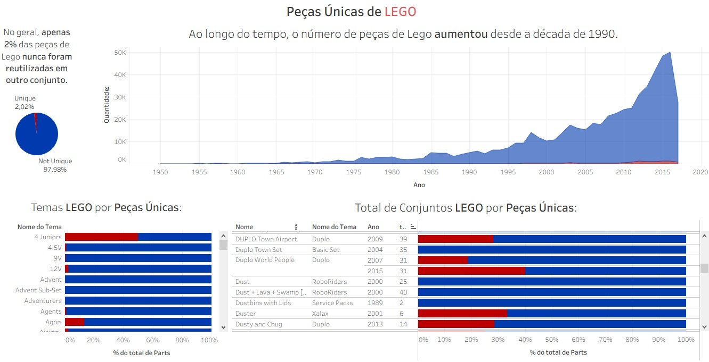

# Dashboard de Análise de Peças Únicas – LEGO

Dashboard desenvolvido no Tableau para analisar a evolução das **peças únicas da LEGO ao longo do tempo**, identificando padrões de reutilização, crescimento da complexidade dos conjuntos e distribuição por temas.

O projeto explora como o número de peças únicas evoluiu historicamente e como isso impacta os diferentes temas e conjuntos da marca.

---

---

## Objetivo do Projeto:

Criar um painel analítico para:

- Avaliar a evolução das peças LEGO ao longo das décadas
- Medir o percentual de peças únicas vs reutilizadas
- Identificar temas com maior proporção de peças exclusivas
- Analisar conjuntos específicos e sua composição

---

## Principais Análises:

### Evolução das Peças Únicas ao Longo do Tempo

Gráfico de área mostrando crescimento contínuo desde a década de 1990.

Insights:

- Forte aumento na quantidade de peças únicas a partir dos anos 2000.
- Crescimento acelerado após 2010.
- Indica aumento na complexidade e diversidade dos conjuntos LEGO.

---

### Percentual de Peças Únicas:

- **Peças únicas:** 2,02%
- **Peças reutilizadas:** 97,98%

Insight:
A grande maioria das peças é reutilizada em múltiplos conjuntos, demonstrando eficiência produtiva e padronização.

---

### Temas LEGO por Peças Únicas:

Análise da porcentagem de peças únicas dentro de cada tema.

Permite identificar:

- Temas com maior inovação estrutural
- Linhas com maior reaproveitamento de peças
- Estratégias de design por segmento

---

### Total de Conjuntos por Peças Únicas:

Visualização detalhada mostrando:

- Nome do conjunto
- Tema
- Ano de lançamento
- Quantidade total de peças
- Percentual de peças únicas

Insight:
Alguns conjuntos apresentam proporção significativamente maior de peças exclusivas, indicando maior investimento em design específico.

---

## Principais Insights Estratégicos:

- A LEGO mantém alta padronização de peças (97,98% reutilização).
- O crescimento de peças únicas acompanha a expansão do portfólio.
- Após os anos 2000, há aceleração na complexidade dos conjuntos.
- Temas específicos apresentam maior inovação estrutural.

---

## Aprendizado:

Este projeto foi desenvolvido acompanhando a aula disponível neste vídeo: https://www.youtube.com/watch?v=9brLkWC9BdU.
Ao longo do projeto, aprofundei meus conhecimentos em conceitos e técnicas importantes 
Recomendo fortemente para quem deseja evoluir seus estudos em Data Analytics e Business Intelligence.
